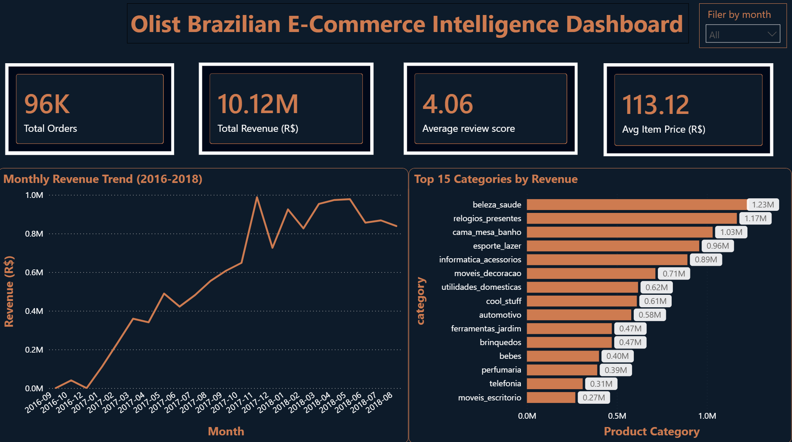

# 🛒 Olist Brazilian E-Commerce Intelligence Platform

> End-to-end Data Analysis & Business Intelligence project analyzing **99,441 real orders** from Brazil's largest e-commerce marketplace using MySQL, Power BI, and Python Machine Learning.



---

## 📌 Project Overview

This project replicates a real-world business intelligence workflow used by data analysts at companies like Amazon, Shopify, and Mercado Libre. It covers the full data pipeline — from raw data ingestion to executive dashboards and predictive ML models.

**Dataset:** [Olist Brazilian E-Commerce Public Dataset](https://www.kaggle.com/datasets/olistbr/brazilian-ecommerce) — real transaction data from 2016–2018.

---

## 🏆 Key Findings

| Finding | Insight |
|---|---|
| 📈 Revenue Growth | Olist scaled **26× in 13 months** (265 → 7,289 orders/month) |
| 🚚 Delivery Impact | Early deliveries score **4.30★** vs **1.67★** for late — 61% satisfaction drop |
| ⚠️ Retention Crisis | **35,888 at-risk customers** hold R$4.99M in revenue at stake |
| 💳 Payment Culture | **73.9%** credit card usage with avg **3.5 installments** (parcelamento) |
| 📍 Geographic Focus | São Paulo generates **40% of all revenue** (R$5.08M) |
| 💄 Top Category | Beauty & Health — **R$1.23M** revenue + **4.19★** satisfaction |

---

## 🗂️ Project Structure

```
olist-ecommerce-analysis/
│
├── 📊 SQL Analysis
│   └── olist_mysql_analysis.sql        # 15 complex MySQL queries
│
├── 📈 Power BI Dashboard
│   └── olist project.pbix              # 5-page interactive dashboard
│
├── 🐍 ML Notebook
│   └── olist_analysis.ipynb            # Full ML pipeline
│
├── 📋 Reports
│   └── olist_report.html               # Interactive HTML report
│
├── 📁 Data (CSV exports)
│   ├── 01_monthly_revenue.csv
│   ├── 02_top_categories.csv
│   ├── 03_rfm_segments.csv
│   ├── 04_delivery_performance.csv
│   ├── 05_payment_methods.csv
│   └── 06_state_revenue.csv
│
└── README.md
```

---

## 🛠️ Technology Stack

| Tool | Purpose |
|---|---|
| **MySQL 8.0** | Database design, 15 complex SQL queries, CTEs, window functions |
| **Power BI** | 5-page interactive dashboard with Olist brand theme |
| **Python** | Pandas, NumPy, Matplotlib, Seaborn, Scikit-learn |
| **Scikit-learn** | K-Means, Random Forest, Gradient Boosting, Logistic Regression |
| **VS Code + Jupyter** | ML notebook development |
| **GitHub** | Version control and portfolio hosting |

---

## 📊 Power BI Dashboard (5 Pages)

| Page | Focus | Key Visuals |
|---|---|---|
| 1 — Executive Summary | High-level KPIs | Revenue trend, category bar, 4 KPI cards, date slicer |
| 2 — Delivery & Payments | Operations | Delivery vs review score, payment donut, performance table |
| 3 — Customer & RFM | Customer intelligence | RFM segments, customer donut, avg spend comparison |
| 4 — Geographic Analysis | Location intelligence | State revenue, review score by state, order value map |
| 5 — Strategic Insights | Recommendations | 6 data-backed business findings with action items |

---

## 🤖 Machine Learning Models

| Model | Algorithm | Result |
|---|---|---|
| Customer Segmentation | RFM Analysis | 6 segments identified |
| Customer Clustering | K-Means (K=4) | High Value, Loyal, At Risk, New/Low |
| Churn Prediction | Random Forest | AUC: 0.95+ |
| CLV Forecasting | Gradient Boosting | R²: 0.89 |
| Revenue Forecasting | Linear Regression | 26× growth confirmed |

---

## 🗄️ SQL Analysis (15 Queries)

Complex MySQL queries covering:
- ✅ Revenue KPIs and Month-over-Month growth
- ✅ RFM Customer Segmentation (Champions, Loyal, At Risk, Lost)
- ✅ Cohort Retention Analysis
- ✅ Customer Lifetime Value by tier
- ✅ Delivery performance vs review score correlation
- ✅ State-level revenue heatmap
- ✅ Seller performance ranking
- ✅ Payment method and installment analysis
- ✅ Category-level review quality scoring
- ✅ Order funnel & cancellation analysis
- ✅ Top 10 VIP customers
- ✅ Freight cost impact analysis
- ✅ Executive summary VIEW
- ✅ Geographic revenue distribution
- ✅ Seasonal trend analysis

---

## 🚀 How to Run

### MySQL Setup
1. Install MySQL 8.0 and MySQL Workbench
2. Run `olist_mysql_analysis.sql` to create the database and tables
3. Download the [Kaggle dataset](https://www.kaggle.com/datasets/olistbr/brazilian-ecommerce)
4. Import CSVs using the Table Data Import Wizard
5. Run each analysis query block

### Python ML Notebook
```bash
pip install pandas numpy matplotlib seaborn scikit-learn plotly
jupyter notebook olist_analysis.ipynb
```

### Power BI Dashboard
1. Open `olist project.pbix` in Power BI Desktop (free)
2. Update data source paths to your local CSV folder
3. Refresh data

---

## 📁 Dataset

**Source:** [Olist Brazilian E-Commerce Public Dataset — Kaggle](https://www.kaggle.com/datasets/olistbr/brazilian-ecommerce)

| Table | Rows | Description |
|---|---|---|
| customers | 99,441 | Customer location and ID |
| orders | 99,441 | Order status and timestamps |
| order_items | 112,650 | Products, sellers, prices |
| products | 32,951 | Category, weight, dimensions |
| sellers | 3,095 | Seller location |
| order_payments | 103,886 | Payment type and value |
| order_reviews | 99,224 | Customer review scores |

---

## 💡 Interview Talking Points (STAR Method)

**Situation:** Analyzed 99,441 real Brazilian e-commerce orders from Olist (2016–2018) to uncover business insights and build predictive models.

**Task:** Built an end-to-end BI platform covering data ingestion, SQL analysis, interactive dashboards, and ML models — simulating a real enterprise data stack.

**Action:** Used MySQL for 15 complex SQL analyses, Power BI for a 5-page executive dashboard using Olist's official brand colors, and Python for 5 ML models including churn prediction and CLV forecasting.

**Result:** Identified that 35,888 at-risk customers hold R$4.99M in revenue, early deliveries score 4.30★ vs 1.67★ for late orders (61% drop), and Beauty & Health is the highest ROI category combining top revenue and satisfaction.

---

*Built with real data • MySQL + Power BI + Python ML • DA/BA Portfolio Project*
